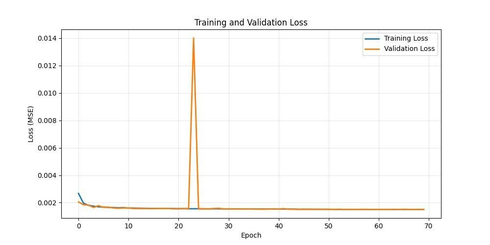

face-denoising-unet/
│
├── README.md                    # This file
├── requirements.txt             # Dependencies
│
├── denoiser.py                  # Main inference class
├── model.py                     # U-Net architecture
├── train.py                     # Training script
├── app.py                       # Gradio web demo
│
├── results/
│   ├── FINAL_COMPARISON.png     # Before/After grid
|   ├── LOSS_CURVE.png
│   ├── NOISE_LEVEL_COMPARISON.png
│   └── CLOSEUP_EXAMPLE.png
└── checkpoints/
    ├── best_model.pth           # Best trained weights
    └── checkpoint_epoch_*.pth   # Periodic saves

#  Face Denoising Autoencoder — U-Net on CelebA

> A deep learning model that removes Gaussian noise from face images and reconstructs them cleanly.  
> Trained on 200K+ CelebA faces | Best Val Loss: 0.001501 | PSNR up to 29.2 dB

-----

##  Results Preview

*Row 1: Noisy Input → Row 2: Denoised → Row 3: Sharpened → Row 4: Original Clean*

-----

##  Quick Results

|Noise Level |PSNR   |Quality        |
|:----------:|:-----:|:-------------:|
|Light (0.1) |29.2 dB| Excellent|
|Medium (0.2)|28.2 dB| Very Good |
|Heavy (0.3) |26.6 dB| Good       |
###  Training Loss Curve

>  PSNR > 25 dB across ALL noise levels = strong reconstruction quality

-----

##  What This Project Does

Unlike basic denoising filters that blur faces, this model:

-  Preserves facial features (eyes, nose, mouth structure)
-  Maintains identity — you can still recognize the person
-  Works across different ages, genders, and lighting conditions

-----

##  Architecture — U-Net with Skip Connections
Input (Noisy 3×64×64)
        │
   ┌────▼────┐
   │  Enc 1  │ → 64 channels  ─────────────────────────┐ skip
   └────┬────┘                                          │
   MaxPool2d                                            │
   ┌────▼────┐                                          │
   │  Enc 2  │ → 128 channels ──────────┐ skip          │
   └────┬────┘                          │               │
   MaxPool2d                            │               │
   ┌────▼────┐                          │               │
   │Bottleneck│ → 256 channels          │               │
   └────┬────┘                          │               │
   ConvTranspose2d                      │               │
   ┌────▼────┐                          │               │
   │  Dec 2  │ ← concat + skip 2 ◄──────┘               │
   └────┬────┘                                          │
   ConvTranspose2d                                      │
   ┌────▼────┐                                          │
   │  Dec 1  │ ← concat + skip 1 ◄─────────────────────┘
   └────┬────┘
   Conv 1×1
        │
Output (Clean 3×64×64)

The secret sauce — skip connections:
# This single line preserves ALL facial details!
c2 = torch.cat([decoder_output, encoder_saved], dim=1)

Instead of forcing everything through the bottleneck, skip connections pass spatial detail directly from encoder to decoder — so edges and facial structure are never lost.

-----
##  How It Works (3 Steps)

Step 1 — Add Gaussian Noise
def add_noise(images, noise_factor=0.2):
    """Simulate real-world image degradation"""
    noisy = images + noise_factor * torch.randn_like(images)
    return torch.clamp(noisy, 0., 1.)

Step 2 — U-Net Learns to Denoise

- Encoder extracts features and identifies noise patterns
- Bottleneck separates noise from facial structure
- Decoder reconstructs the clean face using skip connections

Step 3 — Optional Sharpening
def sharpen_image(image_tensor, strength=0.3):
    """Post-processing to reduce MSE-induced blurriness"""
    kernel = torch.tensor([[-1,-1,-1],[-1,9,-1],[-1,-1,-1]], ...) / 9.0
    sharpened = F.conv2d(image_tensor, kernel, padding=1, groups=3)
    return torch.clamp(image_tensor * (1-strength) + sharpened * strength, 0, 1)

> MSE loss tends to over-smooth outputs — sharpening compensates for this visually.

-----

##  Training Progress
Epoch 1:   Loss 0.0523  ████░░░░░░░░░░░░░░░░
Epoch 30:  Loss 0.0015  ████████████████████
Epoch 70:  Loss 0.0015  ████████████████████ (Converged ✓)

 Total reduction: 97.1% improvement

-----

##  Real-World Applications

|Domain       |Use Case                    |Impact               |
|---------------|----------------------------|---------------------|
| Medical    |Clean MRI/CT scans          |Earlier diagnosis    |
| Security   |Enhance surveillance footage|Better identification|
| Photography|Restore old/damaged photos  |Preserve memories    |
| Video      |Real-time call denoising    |Clearer communication|

-----
 
##  Dataset — CelebA

|Property         |Value        |
|-----------------|-------------|
|Total Images     |202,599 faces|
|Train / Val Split|90% / 10%    |
|Image Size       |64×64 pixels |

-----

##  Training Configuration

|Parameter    |Value                      |
|-------------|---------------------------|
|Framework    |PyTorch 2.6 + CUDA         |
|Hardware     |Kaggle T4 GPU              |
|Epochs       |70 (early stopping at 60)  |
|Batch Size   |128                        |
|Learning Rate|0.001 → 0.00025 (scheduled)|
|Loss Function|MSE                        |
|Optimizer    |Adam + ReduceLROnPlateau   |

-----

##  How to Run
git clone https://github.com/marwaafathy/face-denoising-autoencoder.git
cd face-denoising-autoencoder
pip install torch torchvision pillow matplotlib numpy

Then open the notebook on Kaggle or locally and run all cells.

-----

##  Key Learnings

- Skip connections are essential for image-to-image tasks — without them, fine facial features get destroyed in the bottleneck
- MSE loss produces smooth outputs by design — sharpening post-process compensates visually
- Early stopping + validation monitoring prevents overfitting in pixel-level tasks
- PSNR is more meaningful than raw loss for evaluating reconstruction quality

-----

##  Future Improvements

- [ ] Replace MSE with Perceptual Loss (VGG features) for sharper outputs
- [ ] Add SSIM metric alongside PSNR
- [ ] Try deeper encoder (3rd downsampling level)
- [ ] Deploy as Gradio web demo

-----

##  Acknowledgments

- [CelebA Dataset](http://mmlab.ie.cuhk.edu.hk/projects/CelebA.html) — MMLab, CUHK
- [PyTorch](https://pytorch.org/) — Amazing framework
- [Kaggle](https://kaggle.com) — Free GPU resources

-----

##  Contact

- GitHub: [@marwaafathy](https://github.com/marwaafathy)
- LinkedIn: [Marwa Fathy](https://www.linkedin.com/in/marwaa-fathy-8b1938339)
- Kaggle: [marwaafathy](https://kaggle.com/marwaafathy)# face-denoising-autoencoder
U-Net CNN trained on CelebA to remove noise Gaussian noise from face image and reconstruct them -built with PyTorch
